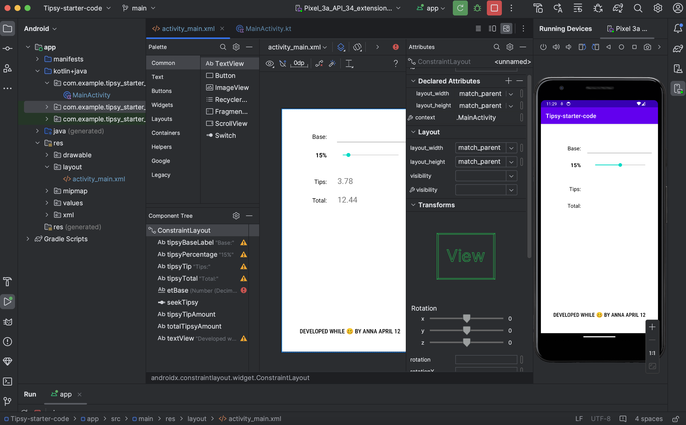
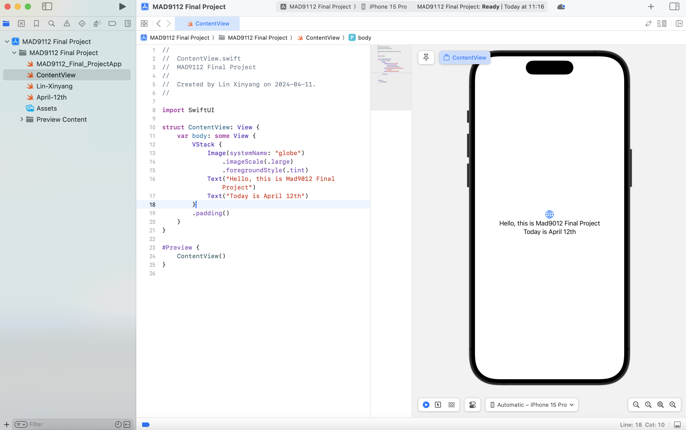
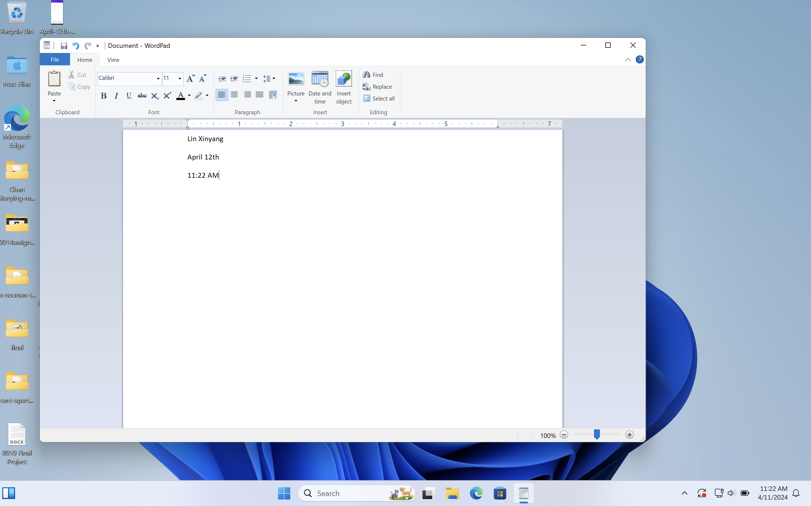

# Lin Xinyang lin00214

# JavaScript

```js
function calculateBMI (weight, height) {
    let adeshBMI = weight / height;
    return adeshBMI;
}

console.log(calculateBMI(90, 1.91));

function interpretBMI (bmi) {
    if (bmi < 18.5) {
        return "Unweight"
    } else if (bmi >= 18.5 && bmi < 25) {
        return "Normal weight"
    } else if (bmi >= 25 && bmi < 30) {
        return "Overweight"
    } else {
        return "Obese"
    }
}

console.log(interpretBMI(24.67));

# step3




# lin00214_Final_Project
